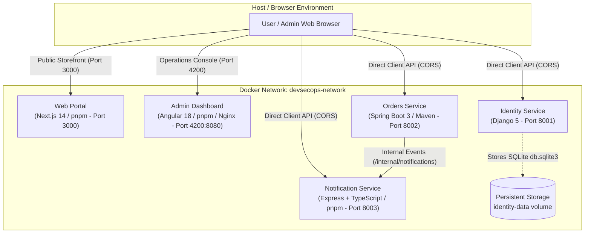

# DevSecOps Multi-Technology Showcase Monorepo

Welcome to the **DevSecOps Showcase Monorepo**. This repository demonstrates a complete, production-minded polyglot microservice ecosystem orchestrated with Docker Compose, featuring five interconnected applications, stateless JWT authentication, role-based access control, cross-origin communication, resilient service-to-service event dispatching, and Shift-Left Developer Security Gates.

---

## 🏛️ System Architecture



---

## 📦 Applications & Port Matrix

| Service                    | Application Directory       | Technology Stack & Package Manager         | Container Port | Host Port | Health Check Endpoint               |
| -------------------------- | --------------------------- | ------------------------------------------ | -------------- | --------- | ----------------------------------- |
| **`web`**                  | `apps/web`                  | Next.js 14 / React 18 (**pnpm**)           | `3000`         | `3000`    | `http://localhost:3000/api/health`  |
| **`dashboard`**            | `apps/dashboard`            | Angular 18 (**pnpm** / Unprivileged Nginx) | `8080`         | `4200`    | `http://localhost:4200/health.json` |
| **`identity-service`**     | `apps/identity-service`     | Django 5 & Gunicorn (Python 3.11 / pip)    | `8001`         | `8001`    | `http://localhost:8001/health`      |
| **`orders-service`**       | `apps/orders-service`       | Spring Boot 3 (Java 21 JRE / Maven)        | `8002`         | `8002`    | `http://localhost:8002/health`      |
| **`notification-service`** | `apps/notification-service` | Express.js / TypeScript (**pnpm**)         | `8003`         | `8003`    | `http://localhost:8003/health`      |

---

## 🛡️ Developer Security Workflow (Shift-Left Gate 1)

This repository enforces automated quality and security checks locally before code is committed to Git:

```
Developer
    ↓
git add <files>
    ↓
git commit -m "feat(identity): add token refresh"
    ↓
Git Hooks (Husky)
    ├── pre-commit: lint-staged
    │     ├── Prettier code formatting
    │     ├── ESLint & Python AST verification
    │     └── Staged Secret Scanner (scripts/scan-secrets.js)
    └── commit-msg: commitlint
          └── Conventional Commits verification
    ↓
Commit Accepted (or Blocked with actionable diagnostics)
```

### 1. Setup & Installation

Git hooks are automatically configured upon dependency installation:

```bash
pnpm install
```

### 2. Developer Commands

| Command                      | Purpose                                                                          |
| ---------------------------- | -------------------------------------------------------------------------------- |
| `pnpm check`                 | Aggregates all local gates: format check, linting, and secret scan               |
| `pnpm format`                | Automatically formats all TypeScript, JavaScript, JSON, YAML, and Markdown files |
| `pnpm format:check`          | Verifies formatting compliance across the codebase without making changes        |
| `pnpm lint`                  | Runs ESLint and Python AST syntax validation                                     |
| `pnpm scan:secrets`          | Runs full-workspace secret scanning                                              |
| `pnpm scan:secrets --staged` | Scans only staged files (executed by `pre-commit` hook)                          |

### 3. Secret Scanning Policy

The secret scanner scans staged files for:

- AWS Access Keys & Secrets
- Private Keys (RSA, EC, OPENSSH, PGP)
- GitHub Tokens & Slack Webhooks
- JWT Tokens & High-Entropy API Keys
- Hardcoded Password Assignments

Allowlists for documentation templates and test mock fixtures are maintained strictly in `security/policies/secrets-allowlist.json`.

### 4. Commit Message Convention

Commit messages are strictly validated via **commitlint** against the Conventional Commits standard:

```
<type>(<scope>): <subject>
```

- **Valid Types**: `feat`, `fix`, `sec`, `security`, `docs`, `chore`, `refactor`, `test`, `style`, `build`, `ci`, `perf`, `revert`
- **Valid Scopes**: `web`, `dashboard`, `identity`, `orders`, `notifications`, `git-hooks`, `infra`, `security`, `root`
- **Examples**:
  - `feat(identity): add token refresh endpoint`
  - `fix(orders): prevent negative order quantity`
  - `sec(git-hooks): add staged secret scanning gate`

---

## 🚀 Running the Stack with Docker Compose

### Prerequisites

- Docker Engine 24.0+ and Docker Compose v2.20+ installed.

### 1. Clone & Configure Environment

No pre-built host artifacts (such as `target/`, `node_modules/`, `dist/`, or `.next/`) are required. The entire stack builds deterministically inside Docker from source:

```bash
git clone <repository>
cd DevSecOps-Monorepo-Shawcase
cp .env.example .env
```

### 2. Build & Launch Stack

```bash
docker compose up --build -d
```

### 3. Verify Container Health

```bash
docker compose ps
```

All 5 services should report `Up (healthy)`.
