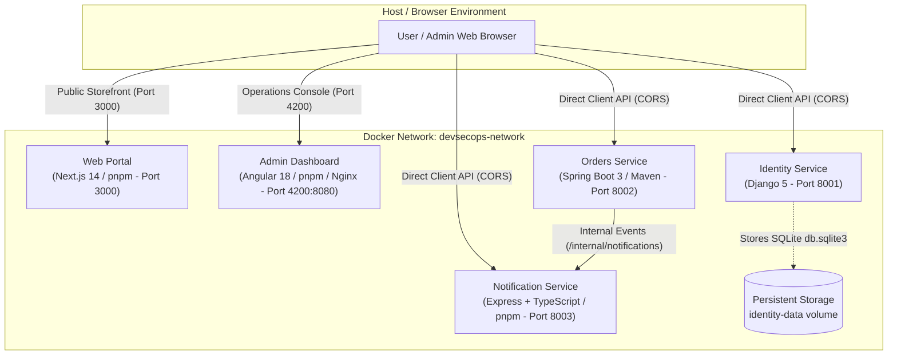

# DevSecOps Multi-Technology Showcase Monorepo

Welcome to the **DevSecOps Showcase Monorepo**. This repository demonstrates a complete, production-minded polyglot microservice ecosystem orchestrated with Docker Compose, featuring five interconnected applications, stateless JWT authentication, role-based access control, cross-origin communication, and resilient service-to-service event dispatching.

---

## 🏛️ System Architecture



---

## 📦 Applications & Port Matrix

| Service | Application Directory | Technology Stack & Package Manager | Container Port | Host Port | Health Check Endpoint |
|---|---|---|---|---|---|
| **`web`** | `apps/web` | Next.js 14 / React 18 (**pnpm**) | `3000` | `3000` | `http://localhost:3000/api/health` |
| **`dashboard`** | `apps/dashboard` | Angular 18 (**pnpm** / Unprivileged Nginx) | `8080` | `4200` | `http://localhost:4200/health.json` |
| **`identity-service`** | `apps/identity-service` | Django 5 & Gunicorn (Python 3.11 / pip) | `8001` | `8001` | `http://localhost:8001/health` |
| **`orders-service`** | `apps/orders-service` | Spring Boot 3 (Java 21 JRE / Maven) | `8002` | `8002` | `http://localhost:8002/health` |
| **`notification-service`** | `apps/notification-service` | Express.js / TypeScript (**pnpm**) | `8003` | `8003` | `http://localhost:8003/health` |

---

## 🚀 Running the Stack with Docker Compose

### Prerequisites
- Docker Engine 24.0+ and Docker Compose v2.20+ installed.
- (Optional for local development outside Docker) Node.js 20+, `pnpm 10+`, Java 21+, Python 3.11+.

### 1. Clone & Configure Environment
No pre-built host artifacts (such as `target/`, `node_modules/`, `dist/`, or `.next/`) are required. The entire stack builds deterministically inside Docker from source:

```bash
git clone <repository>
cd DevSecOps-Monorepo-Shawcase
cp .env.example .env
```

### 2. Build & Launch Stack
```bash
docker compose up --build -d
```

### 3. Verify Container Health
```bash
docker compose ps
```

All 5 services should report `Up (healthy)`.

---

## 🔒 Security & Best Practices

- **Zero Host Artifact Dependency**: All compilation (Java bytecode, TypeScript, Next.js standalone, Angular production bundle) occurs strictly inside multi-stage Docker build stages.
- **Fast & Deterministic Node Builds (`pnpm`)**: Node.js applications use `pnpm` with `--frozen-lockfile` ensuring content-addressable, strict dependency resolution and fast build times.
- **Unprivileged Containers**:
  - `identity-service`: Runs as `appuser:appgroup` (`uid: 1001`).
  - `orders-service`: Runs as `spring:spring` (`uid: 1000`).
  - `notification-service`: Runs as `node:node` (`uid: 1000`).
  - `web`: Runs as `nextjs:nodejs` (`uid: 1001`).
  - `dashboard`: Runs with `nginxinc/nginx-unprivileged:alpine` on non-root port `8080`.
- **Stateless JWT Authentication**: HMAC-SHA256 tokens issued by Identity Service and verified independently across Orders and Notification services.
- **Data Persistence**: SQLite database for identity service persisted via Docker named volume `identity-data`.
- **Security Capabilities Dropped**: `security_opt: ["no-new-privileges:true"]` applied to all containers.
