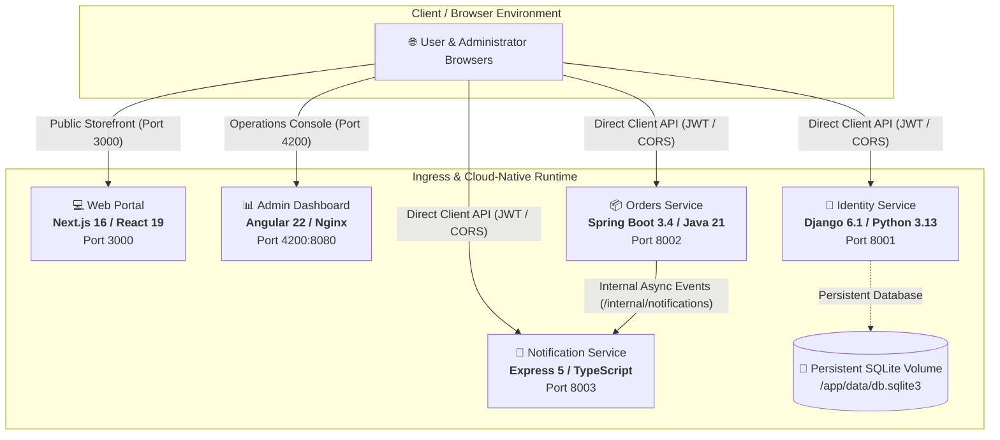
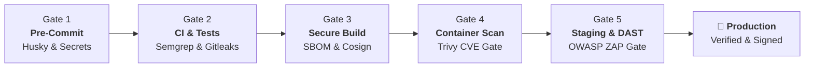

<div align="center">

# 🛡️ Enterprise Polyglot DevSecOps Platform & Showcase

[](https://github.com/O2sa/DevSecOps-Monorepo-Shawcase/actions/workflows/ci.yml)
[](https://github.com/O2sa/DevSecOps-Monorepo-Shawcase/actions/workflows/secure-build.yml)
[](https://github.com/O2sa/DevSecOps-Monorepo-Shawcase/actions/workflows/staging-dast.yml)
[](LICENSE)
[](https://slsa.dev)
[](https://sigstore.dev)

**A reference-grade, end-to-end polyglot microservice ecosystem showcasing zero-trust cloud-native architecture, automated Shift-Left security gates, cryptographic supply chain provenance, and continuous vulnerability scanning.**

[Architecture](#-system-architecture) • [Microservices Matrix](#-applications--technology-matrix) • [Security Pipeline](#-5-stage-shift-left-devsecops-pipeline) • [Supply Chain & SLSA](#-supply-chain-security--cryptographic-verification) • [Quickstart](#-quickstart-guide)

---

</div>

## 🌟 Highlights & Capabilities

- **🚀 Modern Polyglot Microservices**:
  - **Public Storefront Web Portal**: Next.js 16 (Turbopack) & React 19 with ESLint 9 Flat Config.
  - **Admin Operations Dashboard**: Angular 22, TypeScript 6, Zone.js, and Nginx.
  - **Identity & Auth Service**: Django 6.1 (Python 3.13), Django REST Framework 3.18, and Stateless JWT.
  - **Orders Service**: Spring Boot 3.4.3 (Java 21 LTS), Spring Security 6.4.6, and Spring Data JPA.
  - **Notification Service**: Express 5.2.1, Helmet 8.3, and TypeScript 5.9.
- **🛡️ 5-Stage Shift-Left Security Pipeline**:
  - **Gate 1 (Developer Pre-Commit)**: Husky, Prettier, ESLint 9, Python AST validation, and high-entropy secret scanner.
  - **Gate 2 (CI & Static Analysis)**: Multi-layer Jest/JUnit/Django test suites (104 tests), Gitleaks history scanner, and Semgrep SAST.
  - **Gate 3 (Secure Build & Supply Chain)**: Multi-arch Docker Buildx, CycloneDX/SPDX SBOM generation (Syft), SLSA Level 3 Build Provenance attestations, and Sigstore Cosign keyless image signing.
  - **Gate 4 (Container Vulnerability Gate)**: Trivy OS & application vulnerability scanning blocking critical CVEs before deployment.
  - **Gate 5 (Dynamic Staging & DAST Gate)**: Ephemeral Docker Compose staging deployment pinned to exact immutable `@sha256:...` digests, functional smoke testing suite, and OWASP ZAP active/passive DAST scans with custom policy enforcement gates.
- **☸️ Cloud-Native & Kubernetes Infrastructure**:
  - Declarative Kubernetes manifests with Kustomize overlays (`dev`, `staging`, `production`).
  - Strict default-deny `NetworkPolicy` rules, non-root least-privilege Docker images, read-only root filesystems, and health probe configurations.

---

## 🏛️ System Architecture



---

## 📦 Applications & Technology Matrix

| Application              | Directory                   | Framework & Runtime                                     | Package Manager | Port   | Health Check       |
| :----------------------- | :-------------------------- | :------------------------------------------------------ | :-------------- | :----- | :----------------- |
| **Web Portal**           | `apps/web`                  | **Next.js 16.3** + **React 19.2**                       | `pnpm 10`       | `3000` | `GET /api/health`  |
| **Admin Dashboard**      | `apps/dashboard`            | **Angular 22.1** + **TypeScript 6**                     | `pnpm 10`       | `4200` | `GET /health.json` |
| **Identity Service**     | `apps/identity-service`     | **Django 6.1** + **DRF 3.18** (Python 3.13)             | `pip`           | `8001` | `GET /health`      |
| **Orders Service**       | `apps/orders-service`       | **Spring Boot 3.4** + **Spring Security 6.4** (Java 21) | `Maven`         | `8002` | `GET /health`      |
| **Notification Service** | `apps/notification-service` | **Express 5.2** + **Helmet 8.3** (TypeScript 5.9)       | `pnpm 10`       | `8003` | `GET /health`      |

---

## 🛡️ 5-Stage Shift-Left DevSecOps Pipeline



### 1. Shift-Left Gate 1: Local Developer Environment

- **Husky & Lint-Staged**: Enforces code style, TypeScript compiler validation, ESLint 9 checks, and Python syntax checks on every staged commit.
- **Pre-Commit Secret Scanning**: [`scripts/scan-secrets.js`](file:///c:/Users/msii/Documents/devsecops_monorepo/scripts/scan-secrets.js) scans staged files for unencrypted secrets, private keys, and API tokens with strict entropy thresholds.
- **Conventional Commits**: Enforced via `commitlint` for clean semantic changelogs.

```bash
pnpm check          # Run formatting, linting, and full secret scanning
pnpm format         # Auto-format all code files with Prettier
pnpm lint           # Execute ESLint 9 and Python AST checks
pnpm scan:secrets   # Run monorepo-wide secret scanning
```

### 2. Shift-Left Gate 2: CI & Static Analysis (`ci.yml`)

- Executes automated test suites: **104 passing tests** across Next.js, Angular, Express, Django, and Spring Boot.
- **SAST**: Semgrep static application security testing scanning for OWASP Top 10 vulnerabilities.
- **Secret Detection**: Gitleaks deep scanning over full repository git history and commit ranges.
- **SCA**: Filesystem dependency auditing and automated security patch tracking.

### 3. Shift-Left Gate 3: Secure Artifact Packaging (`secure-build.yml`)

- Multi-arch container builds via Docker Buildx.
- **SPDX / CycloneDX SBOM**: Automated Software Bill of Materials generated via Syft and attested via GitHub Actions (`actions/attest-sbom@v2`).
- **SLSA Level 3 Provenance**: Cryptographically attested build provenance (`actions/attest-build-provenance@v2`).
- **Keyless Container Signing**: All 5 container images signed using **Sigstore Cosign** via OIDC identity.
- Exact immutable image digests (`@sha256:...`) extracted and exported as build artifacts.

### 4. Shift-Left Gate 4: Container Vulnerability Scanner

- **Trivy Image Scan**: Scans built container images for OS package vulnerabilities (Alpine/Debian) and application runtime dependencies.
- Enforces strict blocking rules (`exit-code: 1`) on unresolved **Critical** CVEs.
- High and Medium findings cataloged into GitHub Security Code Scanning (SARIF).

### 5. Shift-Left Gate 5: Ephemeral Staging & DAST Gate (`staging-dast.yml`)

- **Cosign Pre-Deployment Gate**: Staging workflow cryptographically verifies container signatures against immutable image digests before deploying.
- **Ephemeral Staging Deployment**: Launches stack using exact `@sha256:...` digest references.
- **Automated Smoke Tests**: [`scripts/smoke-tests.js`](file:///c:/Users/msii/Documents/devsecops_monorepo/scripts/smoke-tests.js) verifies health endpoints, frontend entrypoints, user registration, JWT acquisition, and authenticated service APIs.
- **OWASP ZAP Dynamic Scans**:
  - Web Portal UI Scan (`http://localhost:3000`)
  - Admin Dashboard UI Scan (`http://localhost:4200`)
  - Backend Identity API Scan (`http://localhost:8001/api/auth/login`)
  - Backend Orders API Scan (`http://localhost:8002/api/products`)
  - Backend Notification API Scan (`http://localhost:8003/api/notifications`)
- **DAST Policy Evaluator**: [`scripts/evaluate-dast-policy.js`](file:///c:/Users/msii/Documents/devsecops_monorepo/scripts/evaluate-dast-policy.js) evaluates structured JSON/XML reports, uploading all findings as artifacts and blocking on High or Critical vulnerabilities.

---

## 🔐 Supply Chain Security & Cryptographic Verification

### Verifying Published Images with Sigstore Cosign

Verify signatures on published container images using Sigstore Cosign (keyless OIDC). The staging workflow enforces this check against exact immutable image digests (`@sha256:...`) before deploying:

```bash
# Verify by exact immutable image digest
cosign verify \
  --certificate-identity-regexp "https://github.com/O2sa/DevSecOps-Monorepo-Shawcase/.*" \
  --certificate-oidc-issuer "https://token.actions.githubusercontent.com" \
  ghcr.io/o2sa/devsecops-identity-service@sha256:<digest>
```

### Verifying SLSA Build Provenance

```bash
# Verify SLSA Provenance using GitHub CLI
gh attestation verify oci://ghcr.io/o2sa/devsecops-orders-service@sha256:<digest> \
  --owner O2sa
```

---

## 🚀 Quickstart Guide

### Prerequisites

- [Node.js](https://nodejs.org/) `>= 24.0.0`
- [pnpm](https://pnpm.io/) `>= 10.0.0`
- [Docker & Docker Compose](https://www.docker.com/)
- [Java 21 JDK](https://adoptium.net/) & [Python 3.13](https://www.python.org/) _(for local development without Docker)_

### 1. Clone & Configure

```bash
git clone https://github.com/O2sa/DevSecOps-Monorepo-Shawcase.git
cd DevSecOps-Monorepo-Shawcase
cp .env.example .env
pnpm install
```

### 2. Run All Tests Locally

```bash
pnpm check                # Run format, lint, and secret scanning
pnpm -r --if-present test # Run Jest test suites (Web, Dashboard, Notifications)
cd apps/identity-service && python manage.py test # Run Django test suite
cd ../orders-service && ./mvnw test               # Run Spring Boot test suite
```

### 3. Launch Full Containerized Stack

```bash
docker compose up --build -d
```

### 4. Verify Service Health & Run Smoke Tests

```bash
docker compose ps
pnpm smoke:test
```

### 5. Access Applications

- **Web Storefront Portal**: [http://localhost:3000](http://localhost:3000)
- **Admin Operations Dashboard**: [http://localhost:4200](http://localhost:4200)
- **Identity Service**: [http://localhost:8001/health](http://localhost:8001/health)
- **Orders Service**: [http://localhost:8002/health](http://localhost:8002/health)
- **Notification Service**: [http://localhost:8003/health](http://localhost:8003/health)

---

## ☸️ Kubernetes Deployment

Deploy the zero-trust stack to Kubernetes using Kustomize overlays:

```bash
# Development Overlay
kubectl apply -k infrastructure/kubernetes/overlays/dev

# Staging Overlay (Pinned immutable images & strict resource quotas)
kubectl apply -k infrastructure/kubernetes/overlays/staging

# Production Overlay (High-availability replicas & zero-trust network policies)
kubectl apply -k infrastructure/kubernetes/overlays/production
```

---

## 📄 License & Contributing

This project is open-source under the [MIT License](LICENSE). Contributions, bug reports, and security enhancement PRs are welcome!
