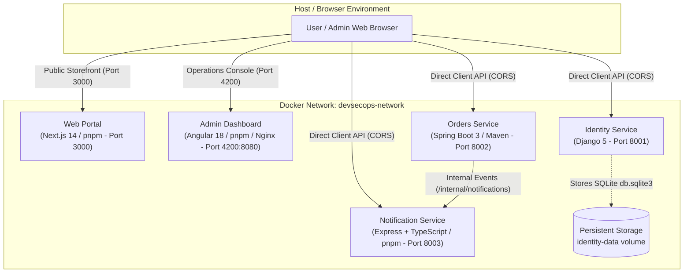

# DevSecOps Multi-Technology Showcase Monorepo

Welcome to the **DevSecOps Showcase Monorepo**. This repository demonstrates a complete, production-minded polyglot microservice ecosystem orchestrated with Docker Compose, featuring five interconnected applications, stateless JWT authentication, role-based access control, cross-origin communication, resilient service-to-service event dispatching, and Shift-Left DevSecOps Security Gates.

---

## 🏛️ System Architecture



---

## 📦 Applications & Port Matrix

| Service                    | Application Directory       | Technology Stack & Package Manager         | Container Port | Host Port | Health Check Endpoint               |
| -------------------------- | --------------------------- | ------------------------------------------ | -------------- | --------- | ----------------------------------- |
| **`web`**                  | `apps/web`                  | Next.js 14 / React 18 (**pnpm**)           | `3000`         | `3000`    | `http://localhost:3000/api/health`  |
| **`dashboard`**            | `apps/dashboard`            | Angular 18 (**pnpm** / Unprivileged Nginx) | `8080`         | `4200`    | `http://localhost:4200/health.json` |
| **`identity-service`**     | `apps/identity-service`     | Django 5 & Gunicorn (Python 3.11 / pip)    | `8001`         | `8001`    | `http://localhost:8001/health`      |
| **`orders-service`**       | `apps/orders-service`       | Spring Boot 3 (Java 21 JRE / Maven)        | `8002`         | `8002`    | `http://localhost:8002/health`      |
| **`notification-service`** | `apps/notification-service` | Express.js / TypeScript (**pnpm**)         | `8003`         | `8003`    | `http://localhost:8003/health`      |

---

## 🛡️ Developer Security Workflow (Shift-Left Gate 1)

This repository enforces automated quality and security checks locally before code is committed to Git:

```
Developer
    ↓
git add <files>
    ↓
git commit -m "feat(identity): add token refresh"
    ↓
Git Hooks (Husky)
    ├── pre-commit: lint-staged
    │     ├── Prettier code formatting
    │     ├── ESLint & Python AST verification
    │     └── Staged Secret Scanner (scripts/scan-secrets.js)
    └── commit-msg: commitlint
          └── Conventional Commits verification
    ↓
Commit Accepted (or Blocked with actionable diagnostics)
```

### Developer Commands

| Command                      | Purpose                                                                          |
| ---------------------------- | -------------------------------------------------------------------------------- |
| `pnpm check`                 | Aggregates all local gates: format check, linting, and secret scan               |
| `pnpm format`                | Automatically formats all TypeScript, JavaScript, JSON, YAML, and Markdown files |
| `pnpm format:check`          | Verifies formatting compliance across the codebase without making changes        |
| `pnpm lint`                  | Runs ESLint and Python AST syntax validation                                     |
| `pnpm scan:secrets`          | Runs full-workspace secret scanning                                              |
| `pnpm scan:secrets --staged` | Scans only staged files (executed by `pre-commit` hook)                          |

---

## 🚀 CI / Pull Request Security Pipeline (Shift-Left Gate 2)

Automated security verification and regression testing run on every Pull Request and Push to `main` via GitHub Actions (`.github/workflows/ci.yml`):

- **Quality & Formatting**: Prettier format check and Next.js ESLint.
- **Secret Detection Scan**: Defense-in-depth Gitleaks v2 scanner checking git history and repository diffs.
- **Application Tests**: Automated Jest, Django (27 tests), and Spring Boot JUnit 5 (28 tests) execution.
- **Build Validation**: Typechecking and production bundle compilation for all applications.
- **SAST (Static Application Security Testing)**: Semgrep multi-language vulnerability analysis.
- **Dependency Security (SCA)**: Trivy filesystem vulnerability audit and automated daily Dependabot PRs.

---

## 🔐 Secure Build & Software Supply Chain (Shift-Left Gate 3)

Trusted builds on `main` and release tags (`v*.*.*`) execute the secure artifact packaging pipeline (`.github/workflows/secure-build.yml`):

```
Push to main / Release Tag
    ↓
Docker Buildx (Multi-Image Build from Source)
    ↓
Publish to GitHub Container Registry (GHCR)
    ↓
Extract Immutable Image Digest (@sha256:...)
    ├── 1. Generate SPDX SBOM via Syft (anchore/sbom-action)
    ├── 2. Attest SBOM to GHCR Image (actions/attest-sboms)
    ├── 3. Attest SLSA Build Provenance (actions/attest-build-provenance)
    └── 4. Keyless Image Signing with Sigstore Cosign (OIDC Token)
```

### 1. Published Container Images

| Application          | Container Registry URI                                  |
| -------------------- | ------------------------------------------------------- |
| Identity Service     | `ghcr.io/<owner>/devsecops-identity-service:latest`     |
| Orders Service       | `ghcr.io/<owner>/devsecops-orders-service:latest`       |
| Notification Service | `ghcr.io/<owner>/devsecops-notification-service:latest` |
| Web Portal           | `ghcr.io/<owner>/devsecops-web:latest`                  |
| Admin Dashboard      | `ghcr.io/<owner>/devsecops-dashboard:latest`            |

### 2. Verifying Image Signatures with Cosign

Images are signed keylessly using GitHub Actions OIDC identity. Verify any image digest using Cosign:

```bash
cosign verify \
  --certificate-identity-regexp "https://github.com/O2sa/DevSecOps-Monorepo-Shawcase/.*" \
  --certificate-oidc-issuer "https://token.actions.githubusercontent.com" \
  ghcr.io/o2sa/devsecops-identity-service:latest
```

### 3. Verifying Build Provenance Attestations

Verify cryptographic provenance and tamper-resistance using the GitHub CLI:

```bash
gh attestation verify \
  oci://ghcr.io/o2sa/devsecops-identity-service:latest \
  --repo O2sa/DevSecOps-Monorepo-Shawcase
```

### 4. Inspecting Software Bills of Materials (SBOM)

Download and inspect the attested SPDX SBOM directly:

```bash
gh attestation verify \
  oci://ghcr.io/o2sa/devsecops-identity-service:latest \
  --repo O2sa/DevSecOps-Monorepo-Shawcase \
  --format json | jq '.[] | select(.predicateType | contains("spdx"))'
```

---

## 🐳 Running the Stack with Docker Compose

### 1. Clone & Configure Environment

No pre-built host artifacts are required. The entire stack builds deterministically inside Docker from source:

```bash
git clone <repository>
cd DevSecOps-Monorepo-Shawcase
cp .env.example .env
```

### 2. Build & Launch Stack

```bash
docker compose up --build -d
```

### 3. Verify Container Health

```bash
docker compose ps
```

All 5 services should report `Up (healthy)`.
