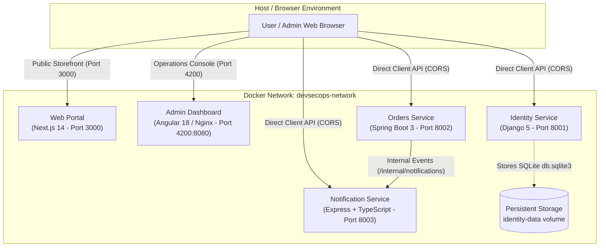

# DevSecOps Multi-Technology Showcase Monorepo

Welcome to the **DevSecOps Showcase Monorepo**. This repository demonstrates a complete, production-minded polyglot microservice ecosystem orchestrated with Docker Compose, featuring five interconnected applications, stateless JWT authentication, role-based access control, cross-origin communication, and resilient service-to-service event dispatching.

---

## 🏛️ System Architecture



---

## 📦 Applications & Port Matrix

| Service | Application Directory | Technology Stack | Container Port | Host Port | Health Check Endpoint |
|---|---|---|---|---|---|
| **`web`** | `apps/web` | Next.js 14 (React 18 / Node 20) | `3000` | `3000` | `http://localhost:3000` |
| **`dashboard`** | `apps/dashboard` | Angular 18 (Unprivileged Nginx) | `8080` | `4200` | `http://localhost:4200/health.json` |
| **`identity-service`** | `apps/identity-service` | Django 5 & Gunicorn (Python 3.11) | `8001` | `8001` | `http://localhost:8001/health` |
| **`orders-service`** | `apps/orders-service` | Spring Boot 3 (Java 21 JRE) | `8002` | `8002` | `http://localhost:8002/health` |
| **`notification-service`** | `apps/notification-service` | Express.js (Node 20 / TypeScript) | `8003` | `8003` | `http://localhost:8003/health` |

---

## 🚀 Running the Stack with Docker Compose

### Prerequisites
- Docker Engine 24.0+ and Docker Compose v2.20+ installed.

### 1. Configure Environment
Copy the environment configuration template:
```bash
cp .env.example .env
```

### 2. Build and Start All Containers
```bash
# Build and run in foreground
docker compose up --build

# Or run in detached background mode:
docker compose up -d --build
```

### 3. Check Container Status and Health
```bash
docker compose ps
```

### 4. Inspect Application Logs
```bash
# Follow all service logs
docker compose logs -f

# Follow specific service logs
docker compose logs -f identity-service
docker compose logs -f orders-service
docker compose logs -f notification-service
docker compose logs -f web
docker compose logs -f dashboard
```

### 5. Stop the Stack
```bash
# Stop containers without removing persistent data
docker compose down

# Stop containers and REMOVE persistent volumes (Warning: resets database data)
docker compose down -v
```

---

## 🔑 Default Administrator Credentials

When the Identity Service starts, the entrypoint script initializes the default superadmin account if not already present:

- **Username**: `admin`
- **Email**: `admin@devsecops.local`
- **Password**: `AdminPassword123!`
- **Role**: `admin`

---

## 🛡️ Container Security & Hardening Baseline

1. **Non-Root Execution**:
   - `identity-service`: Runs as `appuser:appgroup` (`uid: 1001`).
   - `orders-service`: Runs as `spring:spring`.
   - `notification-service`: Runs as `node:node`.
   - `web`: Runs as `nextjs:nodejs` (`uid: 1001`).
   - `dashboard`: Runs as unprivileged Nginx worker (`nginxinc/nginx-unprivileged:alpine`).
2. **Minimal Multi-Stage Builds**:
   - Compilers, development toolchains, and build caches (`node_modules`, Maven `.m2`, temporary build trees) are pruned from final production images.
3. **No New Privileges**:
   - Every service is configured with `security_opt: ["no-new-privileges:true"]`.
4. **Data Isolation**:
   - SQLite persistent data is mounted in a dedicated named volume `identity-data` at `/app/data/` rather than modifying the immutable application filesystem.
5. **CORS Governance**:
   - Microservices restrict cross-origin browser requests to the configured frontend origins (`http://localhost:3000` and `http://localhost:4200`).

---

## 🧪 Local Native Development (Without Docker)

Developers can also run individual services natively:

- **Identity Service**: `cd apps/identity-service && python manage.py runserver 8001`
- **Orders Service**: `cd apps/orders-service && ./mvnw spring-boot:run`
- **Notification Service**: `cd apps/notification-service && npm run dev`
- **Web Portal**: `cd apps/web && npm run dev`
- **Admin Dashboard**: `cd apps/dashboard && npm run dev`

---

## 📖 Further Documentation

- **[System Architecture & Data Flows](docs/architecture/system-overview.md)**
- **[Identity Service Documentation](apps/identity-service/README.md)**
- **[Orders Service Documentation](apps/orders-service/README.md)**
- **[Notification Service Documentation](apps/notification-service/README.md)**
- **[Web Portal Documentation](apps/web/README.md)**
- **[Admin Dashboard Documentation](apps/dashboard/README.md)**
