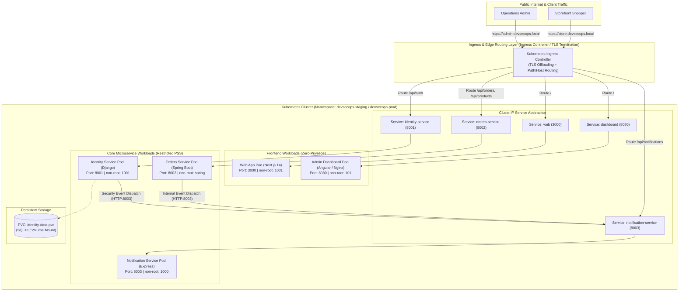
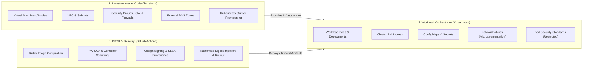

# Infrastructure Architecture & Kubernetes Deployment Foundation

This document defines the comprehensive infrastructure, orchestration, networking, security, and GitOps delivery blueprint for the **DevSecOps Monorepo**.

---

## 🏛️ 1. Complete System Inventory

| Application                | Stack / Runtime                   | Internal Port | External Exposure                            | Persistence               | Downstream Service Communication                          | Health Endpoint    |
| -------------------------- | --------------------------------- | ------------- | -------------------------------------------- | ------------------------- | --------------------------------------------------------- | ------------------ |
| **`identity-service`**     | Django 5 / Python 3.11 / Gunicorn | `8001`        | Ingress (`/api/auth/*`)                      | SQLite PVC (`/app/data`)  | Dispatches security events to `notification-service:8003` | `GET /health`      |
| **`orders-service`**       | Spring Boot 3.3.5 / Java 21 JRE   | `8002`        | Ingress (`/api/orders/*`, `/api/products/*`) | In-memory H2 (Staging)    | Dispatches order events to `notification-service:8003`    | `GET /health`      |
| **`notification-service`** | Express / TypeScript / Node 20    | `8003`        | Ingress (`/api/notifications/*`)             | In-memory store (Staging) | None (leaf receiver)                                      | `GET /health`      |
| **`web`**                  | Next.js 14 Standalone / Node 20   | `3000`        | Ingress (`/` Storefront)                     | Stateless                 | Client-side API calls to Identity & Orders                | `GET /api/health`  |
| **`dashboard`**            | Angular 18 / Unprivileged Nginx   | `8080`        | Ingress (`/` Admin Portal)                   | Stateless                 | Client-side API calls to Identity, Orders, Notifications  | `GET /health.json` |

---

## 🌐 2. Target Kubernetes Deployment Architecture



---

## 🎯 3. Deployment Target Strategy

| Environment Tier            | Target Runtime                                                              | Purpose                                                                                                     | Tooling & Infrastructure              |
| --------------------------- | --------------------------------------------------------------------------- | ----------------------------------------------------------------------------------------------------------- | ------------------------------------- |
| **Local Learning & Dev**    | Docker Compose / **Kind (Kubernetes in Docker)**                            | Rapid developer iteration, local multi-cluster validation, and offline security verification.               | Docker Desktop, Kind, Kustomize       |
| **CI Staging / DAST**       | Ephemeral Docker Compose / Ephemeral Kind Cluster                           | Automated end-to-end integration testing, signature verification, and OWASP ZAP DAST scans.                 | GitHub Actions runner, Kind action    |
| **Production-Ready Target** | Cloud / VPS Lightweight K8s (**k3s**) or Managed Kubernetes (**EKS / GKE**) | Highly available, production-hardened orchestrator with strict zero-trust network policies and KMS secrets. | Terraform, K3s / Cloud K8s, Kustomize |

---

## ⚖️ 4. Separation of Responsibilities: Terraform vs. Kubernetes vs. CI/CD



---

## 📦 5. Kubernetes Workload Mapping per Application

### A. Identity Service (`identity-service`)

- **Kind**: `Deployment` (1 replica) + `Service` (ClusterIP `8001`)
- **Storage**: `PersistentVolumeClaim` (1Gi `ReadWriteOnce`) mounted to `/app/data`
- **ConfigMap**: `DJANGO_DEBUG: "False"`, `PORT: "8001"`, `DJANGO_ALLOWED_HOSTS: "*"`
- **Secret**: `DJANGO_SECRET_KEY`, `DJANGO_SUPERUSER_PASSWORD`
- **Probes**: Liveness `httpGet /health:8001` (initialDelay: 10s), Readiness `httpGet /health:8001` (initialDelay: 5s)
- **Resources**: Requests: `100m CPU / 128Mi RAM`, Limits: `300m CPU / 256Mi RAM`
- **SecurityContext**: `runAsNonRoot: true`, `runAsUser: 1001`, `allowPrivilegeEscalation: false`, `readOnlyRootFilesystem: false` (writes to SQLite volume), `capabilities: { drop: ["ALL"] }`

### B. Orders Service (`orders-service`)

- **Kind**: `Deployment` (1-2 replicas) + `Service` (ClusterIP `8002`)
- **ConfigMap**: `SERVER_PORT: "8002"`, `NOTIFICATION_SERVICE_URL: "http://notification-service:8003"`, `CORS_ALLOWED_ORIGINS: "*"`
- **Secret**: `DJANGO_SECRET_KEY` (shared JWT signing verification key)
- **Probes**: Startup `httpGet /health:8002` (failureThreshold: 30, period: 2s), Liveness `httpGet /health:8002`, Readiness `httpGet /health:8002`
- **Resources**: Requests: `200m CPU / 256Mi RAM`, Limits: `500m CPU / 512Mi RAM`
- **SecurityContext**: `runAsNonRoot: true`, `runAsUser: 10001` (spring), `allowPrivilegeEscalation: false`, `readOnlyRootFilesystem: true` (with `/tmp` emptyDir), `capabilities: { drop: ["ALL"] }`

### C. Notification Service (`notification-service`)

- **Kind**: `Deployment` (1-2 replicas) + `Service` (ClusterIP `8003`)
- **ConfigMap**: `NODE_ENV: "production"`, `PORT: "8003"`, `CORS_ALLOWED_ORIGINS: "*"`
- **Secret**: `JWT_SECRET`
- **Probes**: Liveness `httpGet /health:8003`, Readiness `httpGet /health:8003`
- **Resources**: Requests: `50m CPU / 64Mi RAM`, Limits: `200m CPU / 128Mi RAM`
- **SecurityContext**: `runAsNonRoot: true`, `runAsUser: 1000` (node), `allowPrivilegeEscalation: false`, `readOnlyRootFilesystem: true`, `capabilities: { drop: ["ALL"] }`

### D. Web Portal (`web`)

- **Kind**: `Deployment` (1-2 replicas) + `Service` (ClusterIP `3000`)
- **ConfigMap**: `NODE_ENV: "production"`, `PORT: "3000"`, `HOSTNAME: "0.0.0.0"`
- **Probes**: Liveness `httpGet /api/health:3000`, Readiness `httpGet /api/health:3000`
- **Resources**: Requests: `100m CPU / 128Mi RAM`, Limits: `300m CPU / 256Mi RAM`
- **SecurityContext**: `runAsNonRoot: true`, `runAsUser: 1001` (nextjs), `allowPrivilegeEscalation: false`, `readOnlyRootFilesystem: false`, `capabilities: { drop: ["ALL"] }`

### E. Admin Dashboard (`dashboard`)

- **Kind**: `Deployment` (1-2 replicas) + `Service` (ClusterIP `8080`)
- **ConfigMap**: Nginx configuration / environment replacements
- **Probes**: Liveness `httpGet /health.json:8080`, Readiness `httpGet /health.json:8080`
- **Resources**: Requests: `50m CPU / 32Mi RAM`, Limits: `100m CPU / 64Mi RAM`
- **SecurityContext**: `runAsNonRoot: true`, `runAsUser: 101` (nginx), `allowPrivilegeEscalation: false`, `readOnlyRootFilesystem: false`, `capabilities: { drop: ["ALL"] }`

---

## 🔒 6. Supply Chain & Image Digest Flow to Kubernetes

```
Source Code (GitHub)
    ↓
CI Security Validation (Linting, Tests, SAST, SCA)
    ↓
Docker Buildx (Multi-Stage Immutable Image Compilation)
    ↓
Trivy Image Scan (OS + Application + Misconfiguration Gate)
    ↓
Publish to GHCR (@sha256:<digest>)
    ↓
Syft SBOM Attestation + SLSA Provenance Attestation + Cosign Signature
    ↓
Kustomize Set Image Digest:
kustomize edit set image devsecops-identity-service=ghcr.io/o2sa/devsecops-identity-service@sha256:<digest>
    ↓
Kubernetes Admission (Kyverno / Cosign Policy Verification)
    ↓
Pod Scheduled on Node
```

---

## 🛡️ 7. Zero-Trust Network Policy Blueprint

By default, all ingress and egress traffic is denied across application namespaces. Specific communication channels are explicitly allow-listed:

```mermaid
flowchart TD
    Ingress["Ingress Controller"] -->|HTTP:3000| Web["web"]
    Ingress -->|HTTP:8080| Dash["dashboard"]
    Ingress -->|HTTP:8001| Identity["identity-service"]
    Ingress -->|HTTP:8002| Orders["orders-service"]
    Ingress -->|HTTP:8003| Notify["notification-service"]

    Orders -->|HTTP:8003 /internal/notifications| Notify
    Identity -->|HTTP:8003 /internal/notifications| Notify

    subgraph Blocked["Default Deny Enforcement"]
        Web -.x|Blocked Direct DB/Internal Calls| Notify
        Dash -.x|Blocked Direct DB/Internal Calls| Notify
        Notify -.x|Blocked Outbound Ingress Calls| Web
    end
```

---

## 📂 8. Recommended Infrastructure Repository Layout

```
infrastructure/
├── terraform/                       # Terraform Infrastructure as Code
│   ├── modules/                     # Reusable Terraform modules (vpc, k3s, security-groups)
│   │   ├── compute/
│   │   ├── networking/
│   │   └── security/
│   └── environments/                # Environment-specific tfvars & state
│       ├── staging/
│       │   └── main.tf
│       └── production/
│           └── main.tf
│
└── kubernetes/                      # Declarative Manifests via Kustomize
    ├── base/                        # Base Kubernetes manifests
    │   ├── identity-service.yaml
    │   ├── orders-service.yaml
    │   ├── notification-service.yaml
    │   ├── web.yaml
    │   ├── dashboard.yaml
    │   ├── ingress.yaml
    │   ├── network-policies.yaml
    │   └── kustomization.yaml
    │
    └── overlays/                    # Environment-specific overlays
        ├── dev/
        │   └── kustomization.yaml
        ├── staging/
        │   ├── patches/
        │   └── kustomization.yaml
        └── production/
            ├── patches/
            └── kustomization.yaml
```

### Why Kustomize?

- **Native to `kubectl`** (`kubectl apply -k .`): Zero third-party runtime binary dependencies.
- **Pure Declarative YAML**: No fragile templating or escaping bugs common in complex Helm charts.
- **Clean Environment Inheritance**: Base manifests declare standard pod specifications; overlays patch exact image digests, resource scales, and domain ingress routes per environment.

---

## 🚀 9. Multi-Phase DevSecOps Implementation Roadmap

| Phase                     | Milestone Name                              | Objective                                                                                    | Key Deliverables & Security Controls                                                                        |
| ------------------------- | ------------------------------------------- | -------------------------------------------------------------------------------------------- | ----------------------------------------------------------------------------------------------------------- |
| **Phase 8.1** _(Current)_ | **Infrastructure Architecture Foundation**  | Define complete target architecture, inventory, responsibilities, and K8s blueprints.        | Service inventory, Mermaid models, Kustomize layout, security matrices.                                     |
| **Phase 8.2**             | **Kubernetes Fundamentals & Local Cluster** | Setup reproducible local/CI Kubernetes cluster with Kind & Kustomize base manifests.         | Kind configuration, `infrastructure/kubernetes/base/` manifests, health probes.                             |
| **Phase 8.3**             | **Application Migration to Kubernetes**     | Deploy all 5 microservices, ingress routing, and service-to-service communication on K8s.    | Ingress controller routing, PVC provisioning, automated smoke test validation.                              |
| **Phase 8.4**             | **Kubernetes Security Hardening**           | Enforce zero-trust Pod Security Standards, NetworkPolicies, and admission policies.          | `restricted` PSS, default-deny NetworkPolicies, non-root SecurityContexts, Kyverno/Cosign admission checks. |
| **Phase 8.5**             | **Terraform Infrastructure as Code**        | Provision cloud/VPS infrastructure and Kubernetes clusters deterministically.                | Modular Terraform code, `tfsec`/`checkov` static IaC scanning, least-privilege cloud IAM.                   |
| **Phase 9**               | **Production Deployment & GitOps Strategy** | Establish immutable production releases, automated promotion gates, and rollback mechanisms. | GitOps rollout pipeline, environment promotion gates, canary/blue-green strategy.                           |
| **Phase 10**              | **Runtime Security & Observability**        | Detect live container threats, monitor system telemetry, and alert on anomalies.             | Falco runtime syscall threat detection, Prometheus/Grafana metrics, audit log collection.                   |
