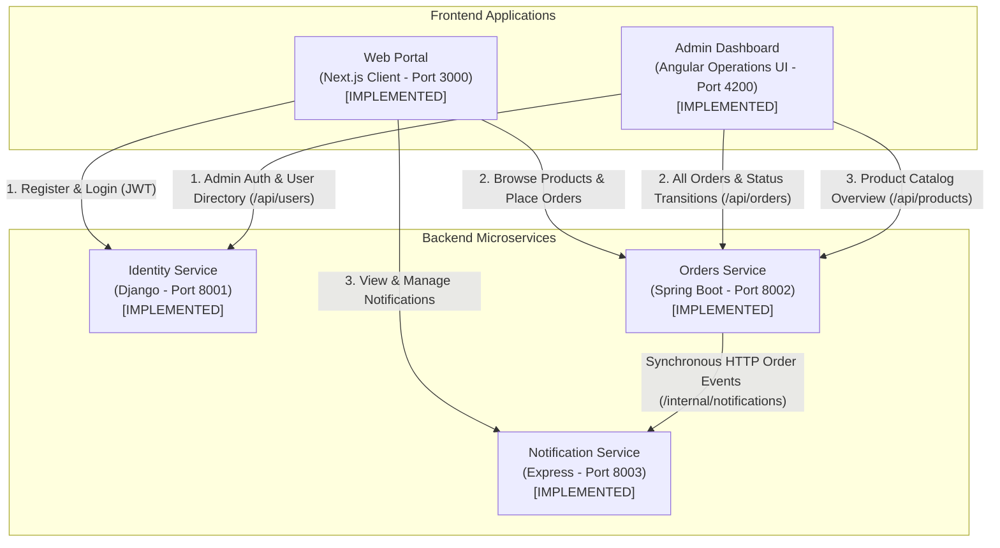

# System Architecture Overview

This document outlines the high-level architecture, user flows, and communication patterns of the **DevSecOps Proof-of-Concept Monorepo**.

> [!NOTE]
> **Implementation Status**:
>
> - **Web Portal (Next.js)**: Implemented. Provides landing page, user registration, login, product browsing, order creation, order tracking, and notifications.
> - **Admin Dashboard (Angular)**: Implemented. Operations console with admin authentication, real-time KPI metrics, system-wide order management with lifecycle transitions (`PENDING` &rarr; `PROCESSING` &rarr; `COMPLETED`), product catalog viewer, and user directory audit.
> - **Identity Service (Django)**: Implemented. Core identity, registration, login, user directory, and JWT token issuance with custom role claims.
> - **Orders Service (Spring Boot)**: Implemented. Product catalog, order creation, user order isolation, admin order status transitions, and JWT validation.
> - **Notification Service (Express + TypeScript)**: Implemented. Internal event ingestion (`POST /internal/notifications`), user notification retrieval, and read state tracking.
> - **Orders &rarr; Notification Integration**: Implemented. Orders Service synchronously dispatches order creation events to Notification Service via HTTP `POST /internal/notifications`.

---

## 🏛️ System Architecture

The architecture connects the user-facing Web Portal and operations Dashboard to domain backend services:



---

## 👥 User & Service Interaction Flows

### 1. Public User Journey (Web Portal)

```
                          Web Portal (Next.js)
                                   │
         ┌─────────────────────────┼─────────────────────────┐
         │ (1. Auth)               │ (2. Orders)             │ (3. Notifications)
         ▼                         ▼                         ▼
  Identity Service           Orders Service          Notification Service
      (Django)                (Spring Boot)             (Express + TS)
                                   │                         ▲
                                   └───────── HTTP ──────────┘
                                      POST /internal/notifications
```

1. **User Registration & Login**: User submits credentials to `/register` and `/login`. The Django Identity Service validates credentials and returns an HMAC-SHA256 JWT access token.
2. **Browsing & Order Placement**: User browses `/products`. When logged in, placing an order calls `POST /api/orders` on the Spring Boot Orders Service with `Authorization: Bearer <token>`.
3. **Internal Event Notification**: Orders Service persists the order in H2 and dispatches `POST /internal/notifications` to the Notification Service (`userId`, `type="ORDER_CREATED"`, title, message).
4. **Order Tracking & Notifications**: User views personal order history on `/orders` and real-time alerts on `/notifications`.

---

### 2. Administrator & Operations Journey (Admin Dashboard)

```
                         Admin Dashboard (Angular)
                                   │
         ┌─────────────────────────┴─────────────────────────┐
         │ (1. Admin Auth & Users)                           │ (2. Orders & Status)
         ▼                                                   ▼
  Identity Service                                     Orders Service
  (Django - Port 8001)                                 (Spring Boot - Port 8002)
  - POST /api/auth/login                               - GET /api/orders
  - GET /api/users (Directory)                         - PATCH /api/orders/{id}/status
```

1. **Admin Login**: Admin logs in with `admin` / `AdminPassword123!`. Role `admin` / `is_admin=true` verified from JWT claims.
2. **Operations Dashboard**: Real-time aggregated statistics (orders, revenue, pending counts, registered accounts).
3. **Order Management**: System-wide order table with status filtering (`ALL`, `PENDING`, `PROCESSING`, `COMPLETED`) and interactive status transitions (`PATCH /api/orders/{id}/status`).
4. **User Directory**: Audits all registered user accounts and assigned roles (`GET /api/users`).

---

## 🔌 Communication Matrix & Implementation Status

| Source          | Destination          | Protocol / Route                        | Purpose                                                | Status                |
| --------------- | -------------------- | --------------------------------------- | ------------------------------------------------------ | --------------------- |
| Web Portal      | Identity Service     | REST / `/api/auth/*`, `/api/users/me`   | User registration, login, profile introspection        | **Implemented**       |
| Web Portal      | Orders Service       | REST / `/api/products`, `/api/orders/*` | Catalog queries, order placement, order history        | **Implemented**       |
| Web Portal      | Notification Service | REST / `/api/notifications/*`           | Notification queries, unread filtering, read marking   | **Implemented**       |
| Orders Service  | Notification Service | REST / `/internal/notifications`        | Synchronous order creation dispatch (`ORDER_CREATED`)  | **Implemented**       |
| Admin Dashboard | Identity Service     | REST / `/api/auth/login`, `/api/users`  | Admin authentication, user directory & RBAC audit      | **Implemented**       |
| Admin Dashboard | Orders Service       | REST / `/api/products`, `/api/orders/*` | Product catalog viewing, system orders, status updates | **Implemented**       |
| Services        | Notification Service | Message Broker (Kafka / RabbitMQ)       | Asynchronous decoupled event streams                   | _Planned (Phase 2+)_  |
| Services        | Services             | mTLS / Service Mesh                     | Service-to-service mutual authentication               | _Planned (Hardening)_ |
