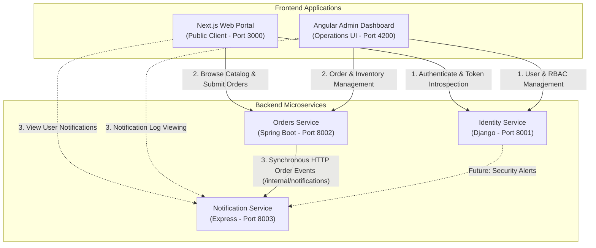

# System Architecture Overview

This document outlines the high-level architecture, user flows, and communication patterns of the **DevSecOps Proof-of-Concept Monorepo**.

> [!NOTE]
> **Implementation Status**:
> - **Identity Service (Django)**: Core identity, registration, login, and JWT token issuance are implemented.
> - **Orders Service (Spring Boot)**: Product catalog, order creation, user order isolation, admin order status transitions, and JWT validation are implemented.
> - **Notification Service (Express + TypeScript)**: Internal event ingestion (`POST /internal/notifications`), user notification retrieval, and read state tracking are implemented.
> - **Service-to-Service Integration**: Orders Service synchronously dispatches order creation events to Notification Service via HTTP `POST /internal/notifications`.

---

## 🏛️ System Architecture

The architecture connects client frontends directly to domain backend services, with synchronous service-to-service communication established between Orders and Notifications:



---

## 👥 User & Service Interaction Flows

### 1. Public Order & Notification Flow
```
                Next.js (Public Web)
                   │
          ┌────────┴────────┐
          ▼                 ▼
Identity Service      Orders Service
   (Django)            (Spring Boot)
                           │
                           │ Synchronous HTTP
                           │ (POST /internal/notifications)
                           ▼
                  Notification Service
                  (Express + TypeScript)
```
1. **Authentication**: User logs in at the Django Identity Service and receives an HMAC-SHA256 JWT containing claims (`user_id`, `role`, etc.).
2. **Order Placement**: User calls `POST /api/orders` on the Orders Service with the Bearer JWT.
3. **Internal Notification Dispatch**: The Orders Service creates the order in its database and dispatches a synchronous HTTP request to `POST /internal/notifications` on the Notification Service (`userId`, `type="ORDER_CREATED"`, title, message).
4. **Resilient Failure Handling**: If the Notification Service is temporarily unreachable, the Orders Service logs the error and returns `201 Created` without failing or rolling back the customer order.
5. **Notification Retrieval**: The user calls `GET /api/notifications` or `GET /api/notifications/unread` on the Notification Service with their JWT to view notifications.

---

### 2. Administrator / Operations User Flow
```
              Angular Dashboard (Admin UI)
                     │
          ┌──────────┼──────────┐
          ▼          ▼          ▼
   Identity Service  Orders Service  Notification Service
       (Django)       (Spring Boot)        (Express)
```
- **Angular Dashboard &rarr; Identity Service**: User administration, role assignments (`admin` vs `user`), and security audit inspection.
- **Angular Dashboard &rarr; Orders Service**: System-wide order querying (`GET /api/orders`) and status updates (`PATCH /api/orders/{id}/status`).
- **Angular Dashboard &rarr; Notification Service**: Notification audit inspection and status monitoring.

---

## 🔌 Communication Protocols & Implementation Status

| From | To | Protocol / Format | Responsibility | Current Implementation Status |
|---|---|---|---|---|
| Frontend | Identity Service | HTTPS / REST (JSON) | Login, Register, Session introspection (`/api/auth/*`, `/api/users/me`) | **Implemented** (Django) |
| Frontend | Orders Service | HTTPS / REST (JSON) | Product catalog queries, Order placement (`/api/products`, `/api/orders`) | **Implemented** (Spring Boot) |
| Frontend | Notification Service | HTTPS / REST (JSON) | Notification queries, Read status (`/api/notifications/*`) | **Implemented** (Express + TS) |
| Orders Service | Notification Service | HTTP / REST (`/internal/notifications`) | Synchronous order notification dispatch (`ORDER_CREATED`) | **Implemented** (HTTP client) |
| Orders / Identity | Notification Service | Event Broker (Kafka / RabbitMQ) | Asynchronous decoupled event streams | *Planned (Phase 2+)* |
| Services | Services | mTLS / Service Auth | Internal service-to-service mutual authentication | *Planned (Security Hardening)* |
