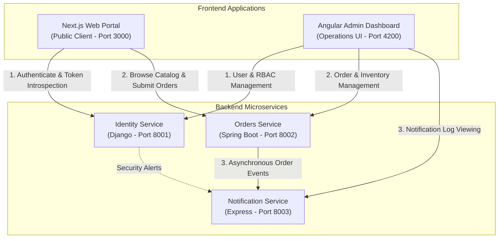

# System Architecture Overview

This document outlines the high-level architecture, user flows, and communication patterns of the **DevSecOps Proof-of-Concept Monorepo**.

> [!NOTE]
> **Implementation Status**: This document illustrates the intended architecture for the complete platform. Currently in Phase 1, the **Identity Service** has active business and auth APIs, while the remaining services and frontends are scaffolded with operational health endpoints. Service-to-service communication will be progressively wired in Phase 2.

---

## 🏛️ System Architecture

The intended communication model consists of direct, decoupled interactions from client frontends to specialized microservices, rather than a monolithic sequential chain:



---

## 👥 Intended Future User Interaction Flows

### 1. Public User Flow
```
                Next.js (Public Web)
                   │
          ┌────────┴────────┐
          ▼                 ▼
Identity Service      Orders Service
   (Django)            (Spring Boot)
                           │
                           ▼
                  Notification Service
                       (Express)
```
- **Next.js &rarr; Identity Service**: User registration, login, JWT token issuance, and account profile retrieval.
- **Next.js &rarr; Orders Service**: Product catalog browsing and order placement using bearer JWT.
- **Orders Service &rarr; Notification Service**: Emits asynchronous order confirmation events for email/alert delivery.

---

### 2. Administrator / Operations User Flow
```
              Angular Dashboard (Admin UI)
                     │
          ┌──────────┼──────────┐
          ▼          ▼          ▼
   Identity Service  Orders Service  Notification Service
       (Django)       (Spring Boot)        (Express)
```
- **Angular Dashboard &rarr; Identity Service**: User administration, role assignments (`admin` vs `user`), and security audit inspection.
- **Angular Dashboard &rarr; Orders Service**: Order lifecycle updates, catalog curation, and inventory adjustments.
- **Angular Dashboard &rarr; Notification Service**: System-wide announcement broadcasting and notification audit log inspection.

---

## 🔌 Communication Protocols & Interfaces

| From | To | Protocol / Format | Future Responsibility | Current Phase Status |
|---|---|---|---|---|
| Next.js | Identity Service | HTTPS / REST (JSON) | Login, Register, Session introspection (`/api/auth/*`, `/api/users/me`) | Implemented (Identity Service) |
| Next.js | Orders Service | HTTPS / REST (JSON) | Product catalog queries, Order placement | Scaffolded (Phase 1) |
| Angular | Identity Service | HTTPS / REST (JSON) | User management, Role assignment (`/api/users`) | Implemented (Identity Service) |
| Angular | Orders Service | HTTPS / REST (JSON) | Order lifecycle management, Catalog updates | Scaffolded (Phase 1) |
| Angular | Notification Service | HTTPS / REST (JSON) | System announcements & alert history | Scaffolded (Phase 1) |
| Orders Service | Notification Service | HTTP / Webhook / Event | Async order event triggers (`ORDER_PLACED`, `ORDER_SHIPPED`) | Planned (Phase 2) |
| Identity Service| Notification Service | HTTP / Webhook / Event | Security events (`PASSWORD_RESET`, `LOGIN_ANOMALY`) | Planned (Phase 2) |
