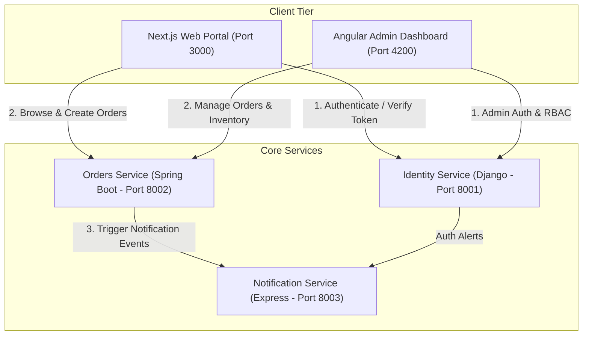

# System Architecture Overview

This document outlines the high-level architecture, user flows, and communication patterns of the **DevSecOps Proof-of-Concept Monorepo**.

---

## 🏛️ System Overview

The system consists of two user-facing frontends and three decoupled backend microservices:



---

## 👥 Intended Future User Interaction Flows

### 1. Public User Flow
```
Next.js (Public Web)
    │
    ▼
Identity Service (Django)
    │  - Authenticate user credentials
    │  - Issue JWT access & refresh tokens
    │
    ▼
Orders Service (Spring Boot)
    │  - Validate token claims
    │  - Fetch product catalog
    │  - Submit customer order
    │
    ▼
Notification Service (Express)
       - Dispatch order confirmation email / receipt
```

### 2. Administrator / Operations User Flow
```
Angular Dashboard (Admin UI)
    │
    ▼
Identity Service (Django)
    │  - Authenticate administrator
    │  - Verify Admin / Ops RBAC role permissions
    │  - Manage user accounts and permissions
    │
    ▼
Orders Service (Spring Boot)
    │  - Retrieve system-wide order logs & metrics
    │  - Update order statuses (Confirmed -> Shipped)
    │  - Manage inventory levels
    │
    ▼
Notification Service (Express)
       - Broadcast administrative system notices
```

---

## 🔌 Communication Protocols & Interfaces

| From | To | Protocol / Format | Future Responsibility |
|---|---|---|---|
| Next.js | Identity Service | HTTPS / REST (JSON) | Login, Register, Session introspection |
| Next.js | Orders Service | HTTPS / REST (JSON) | Product catalog queries, Order placement |
| Angular | Identity Service | HTTPS / REST (JSON) | User management, Role assignment |
| Angular | Orders Service | HTTPS / REST (JSON) | Order lifecycle management, Catalog updates |
| Angular | Notification Service | HTTPS / REST (JSON) | System announcements & alert history |
| Orders Service | Notification Service | HTTP / Webhook / Event | Async order event triggers (`ORDER_PLACED`, `ORDER_SHIPPED`) |
| Identity Service| Notification Service | HTTP / Webhook / Event | Security events (`PASSWORD_RESET`, `LOGIN_ANOMALY`) |
