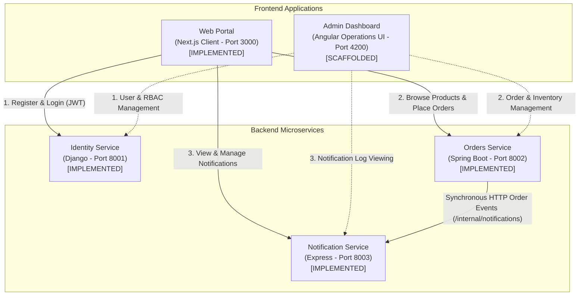

# System Architecture Overview

This document outlines the high-level architecture, user flows, and communication patterns of the **DevSecOps Proof-of-Concept Monorepo**.

> [!NOTE]
> **Implementation Status**:
> - **Web Portal (Next.js)**: Implemented. Provides landing page, user registration, login, product browsing, order creation, order tracking, and notifications.
> - **Identity Service (Django)**: Implemented. Core identity, registration, login, and JWT token issuance.
> - **Orders Service (Spring Boot)**: Implemented. Product catalog, order creation, user order isolation, admin order status transitions, and JWT validation.
> - **Notification Service (Express + TypeScript)**: Implemented. Internal event ingestion (`POST /internal/notifications`), user notification retrieval, and read state tracking.
> - **Orders &rarr; Notification Integration**: Implemented. Orders Service synchronously dispatches order creation events to Notification Service via HTTP `POST /internal/notifications`.

---

## 🏛️ System Architecture

The architecture connects the user-facing Web Portal and operations Dashboard to domain backend services:



---

## 👥 User & Service Interaction Flows

### 1. Public User Journey (Web Portal)
```
                          Web Portal (Next.js)
                                   │
         ┌─────────────────────────┼─────────────────────────┐
         │ (1. Auth)               │ (2. Orders)             │ (3. Notifications)
         ▼                         ▼                         ▼
  Identity Service           Orders Service          Notification Service
      (Django)                (Spring Boot)             (Express + TS)
                                   │                         ▲
                                   └───────── HTTP ──────────┘
                                      POST /internal/notifications
```
1. **User Registration & Login**: User submits credentials to `/register` and `/login`. The Django Identity Service validates credentials and returns an HMAC-SHA256 JWT access token.
2. **Browsing & Order Placement**: User browses `/products`. When logged in, placing an order calls `POST /api/orders` on the Spring Boot Orders Service with `Authorization: Bearer <token>`.
3. **Internal Event Notification**: Orders Service persists the order in H2 and dispatches `POST /internal/notifications` to the Notification Service (`userId`, `type="ORDER_CREATED"`, title, message). If the Notification Service is temporarily unavailable, the order creation succeeds without rollback.
4. **Order Tracking & Notifications**: User views personal order history on `/orders` and real-time alerts on `/notifications`.

---

## 🔌 Communication Matrix & Implementation Status

| Source | Destination | Protocol / Route | Purpose | Status |
|---|---|---|---|---|
| Web Portal | Identity Service | REST / `/api/auth/*`, `/api/users/me` | User registration, login, profile introspection | **Implemented** |
| Web Portal | Orders Service | REST / `/api/products`, `/api/orders/*` | Catalog queries, order placement, order history | **Implemented** |
| Web Portal | Notification Service | REST / `/api/notifications/*` | Notification queries, unread filtering, read marking | **Implemented** |
| Orders Service | Notification Service | REST / `/internal/notifications` | Synchronous order creation dispatch (`ORDER_CREATED`) | **Implemented** |
| Admin Dashboard | Backend Services | REST (Various) | Operations & management dashboard | *Scaffolded (Phase 1)* |
| Services | Notification Service | Message Broker (Kafka / RabbitMQ) | Asynchronous decoupled event streams | *Planned (Phase 2+)* |
| Services | Services | mTLS / Service Mesh | Service-to-service mutual authentication | *Planned (Hardening)* |
