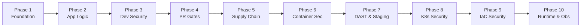

# DevSecOps Implementation Roadmap

This roadmap outlines the progressive evolution of the monorepo from initial scaffolding into a fully realized, enterprise-grade DevSecOps platform across 10 structured phases.

---

## 🗺️ Progressive 10-Phase DevSecOps Lifecycle

---

### Phase 1: Monorepo Foundation & Scaffolding *(Completed)*
- **Objective**: Establish polyglot monorepo layout, independent runnability, clean container blueprints, and documentation.
- **Components**: Next.js, Angular, Django, Spring Boot, Express.
- **Deliverables**: Health check endpoints, root Docker Compose, unified `.gitignore`, `.editorconfig`.

---

### Phase 2: Application Functionality & Inter-Service Communication
- **Objective**: Implement core business features and secure communication contracts.
- **Identity Service**: JWT token generation, user models, login/registration endpoints.
- **Orders Service**: Product catalog entity models, order REST APIs.
- **Notification Service**: Notification dispatcher and internal event receiver.
- **Web & Dashboard**: Client and admin interfaces consuming backend APIs.

---

### Phase 3: Developer Security Controls (Shift-Left)
- **Objective**: Prevent security vulnerabilities and secrets from entering the repository.
- **Pre-commit Hooks**: Enforce linting, formatting, and security scans locally before git commits.
- **Secret Scanning**: Local `gitleaks` and `trufflehog` pre-commit hooks to block committed credentials.
- **IDE Extensions & Linters**: ESLint security plugins, Bandit for Python, SpotBugs/FindSecBugs for Java.

---

### Phase 4: Pull Request Security Checks (Automated CI Gates)
- **Objective**: Enforce automated quality and security gates on every pull request.
- **Static Application Security Testing (SAST)**: Semgrep scans configured with security rules for all 5 frameworks.
- **Software Composition Analysis (SCA)**: Dependency vulnerability scans via Snyk / Trivy / Dependabot.
- **Quality Gates**: Blocking PR merge on High/Critical CVEs or unaddressed SAST findings.

---

### Phase 5: Build & Software Supply-Chain Security
- **Objective**: Guarantee integrity, provenance, and authenticity of all software artifacts.
- **SBOM Generation**: Generate CycloneDX / SPDX Software Bill of Materials using `syft` during container builds.
- **Cryptographic Signing**: Image signing using `cosign` (Sigstore) with keyless OIDC authentication.
- **SLSA Provenance**: Attestation generation achieving SLSA Level 3 build standards.

---

### Phase 6: Container Security & Hardening
- **Objective**: Minimize attack surfaces across all container images.
- **Minimal Base Images**: Distroless or Alpine baselines for zero unnecessary shell utilities.
- **Non-root Execution**: Verified unprivileged execution across all 5 containers.
- **Vulnerability Scanning**: Automated image scanning via Trivy & Grype in CI before pushing to registry.
- **Dockerfile Linting**: `hadolint` enforcement against Docker best practice violations.

---

### Phase 7: Staging Deployment & Dynamic Application Security Testing (DAST)
- **Objective**: Test runtime behavior and API endpoints against active exploit patterns.
- **Automated DAST**: OWASP ZAP automated baseline and API scans against staging environment.
- **Fuzz Testing**: REST API fuzzing using Schemathesis against OpenAPI/Swagger definitions.
- **Security Scenarios**: Automated regression tests validating rate-limiting, CORS, and auth bypass resilience.

---

### Phase 8: Kubernetes Security & Zero-Trust Policies
- **Objective**: Secure orchestration layer and enforce zero-trust pod isolation.
- **Pod Security Standards (PSS)**: Enforce `restricted` PSS profile across all application namespaces.
- **Policy Enforcement**: OPA/Gatekeeper or Kyverno validating image signatures and required labels.
- **Microsegmentation**: Kubernetes `NetworkPolicies` enforcing default deny with explicit communication allow-lists.
- **Secret Management**: External Secrets Operator syncing secrets securely from cloud KMS/Vault.

---

### Phase 9: Infrastructure as Code (IaC) Security & Cloud Governance
- **Objective**: Prevent cloud misconfigurations before infrastructure deployment.
- **Static IaC Scanning**: `checkov`, `tfsec`, and `trivy config` integrated into Terraform CI pipelines.
- **Cost & Blast Radius Evaluation**: `infracost` automated budget impact analysis on PRs.
- **CIS Benchmarks**: Automated compliance auditing against AWS/GCP CIS Foundations Benchmarks.

---

### Phase 10: Runtime Security & Observability
- **Objective**: Detect, alert, and respond to live threats in real time.
- **Threat Detection**: `Falco` runtime rule engine detecting unauthorized syscalls and namespace escapes.
- **Distributed Tracing & Metrics**: OpenTelemetry integration propagating trace headers across all 5 services.
- **Security Monitoring**: Centralized dashboards (Prometheus + Grafana / Grafana Loki) tracking 4xx/5xx spikes, auth failures, and container restarts.
